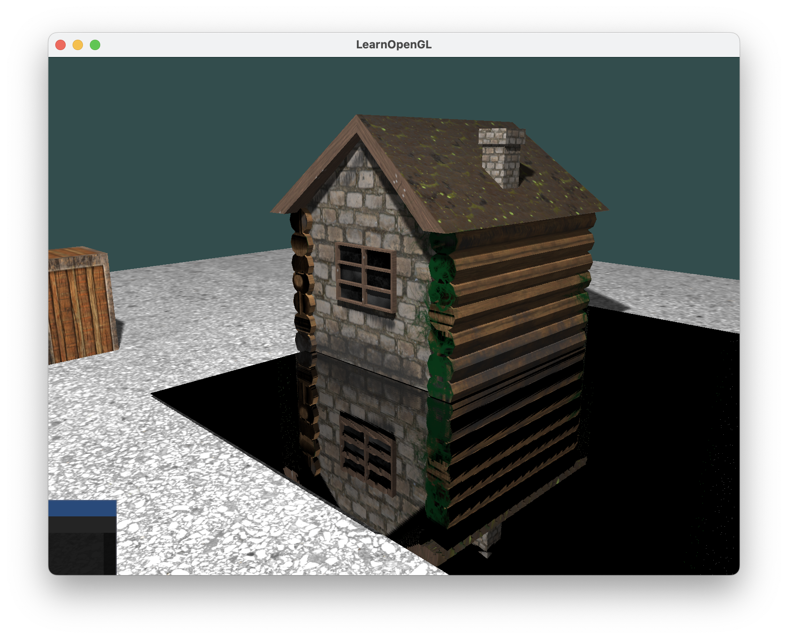
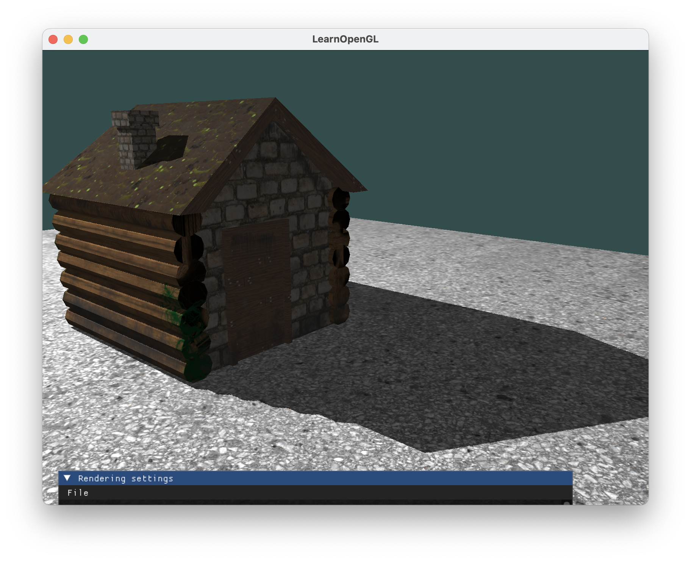
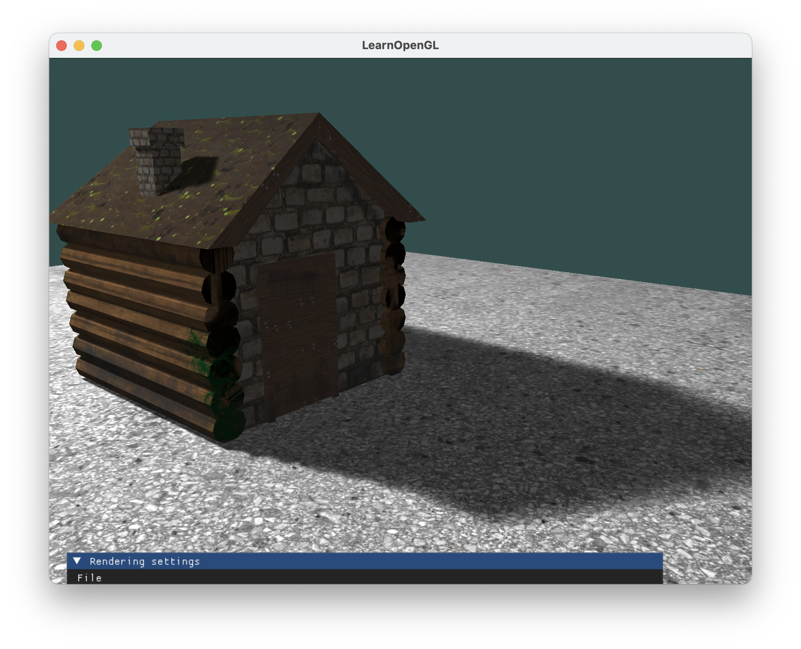
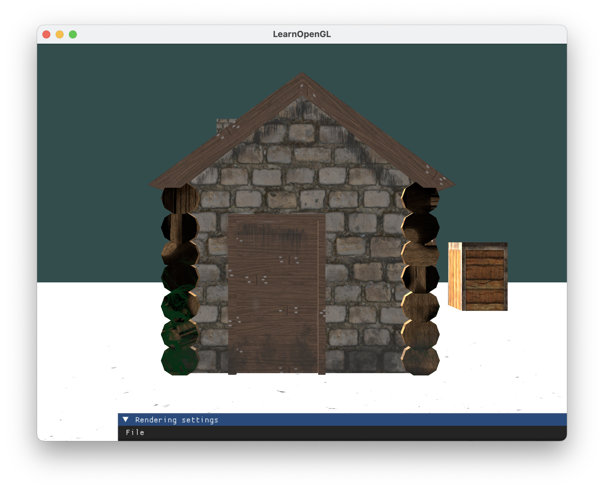
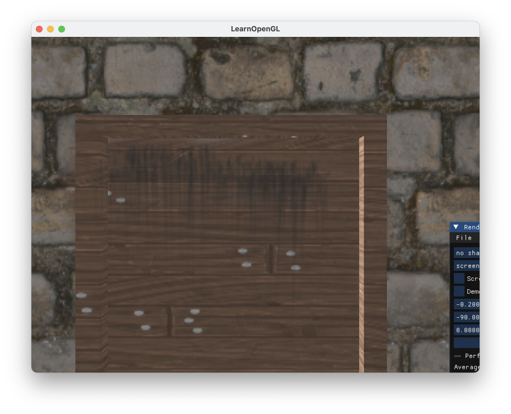
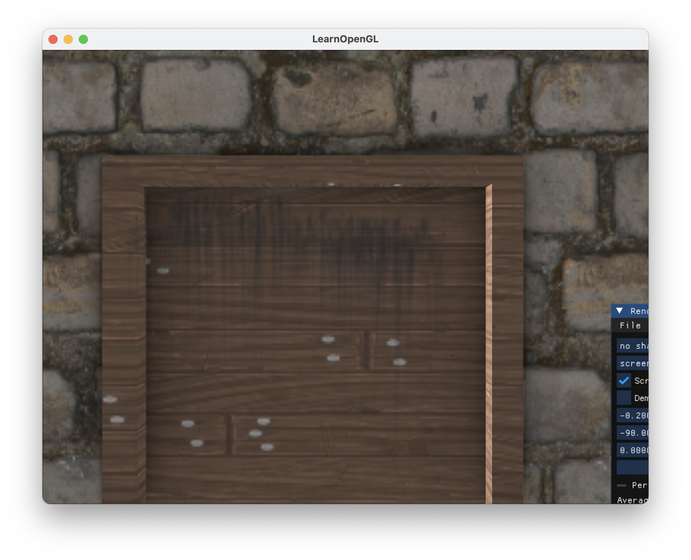
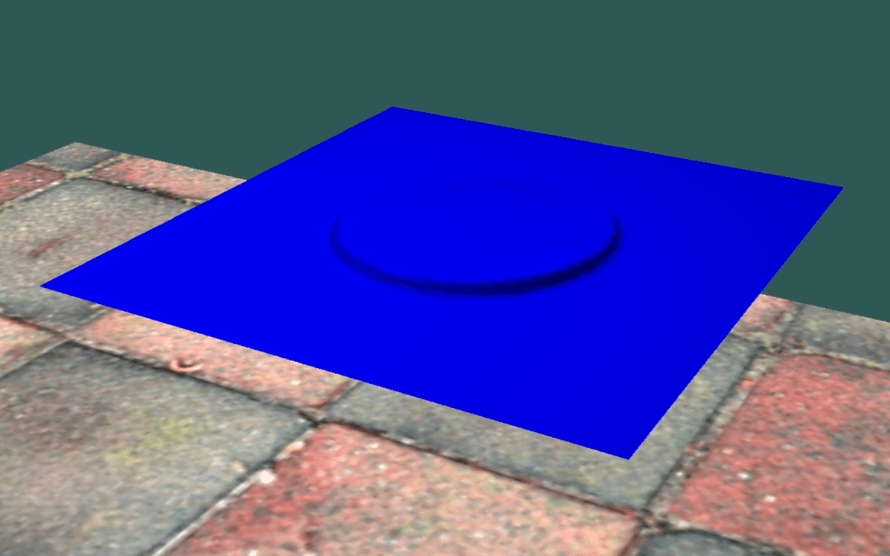
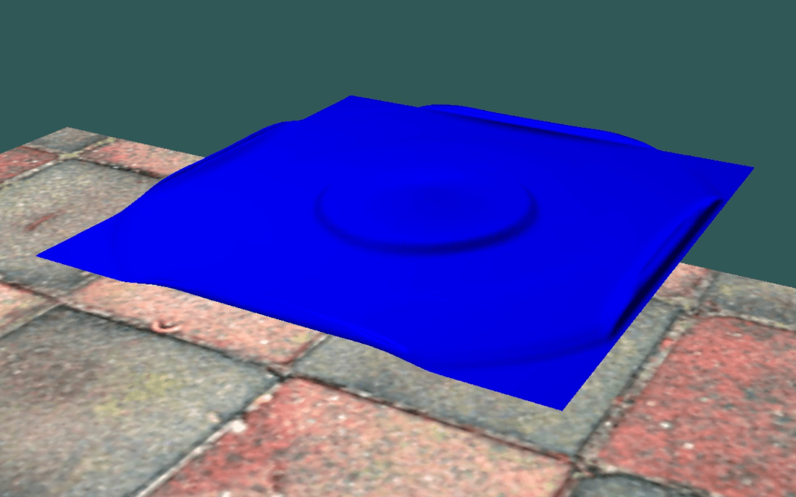
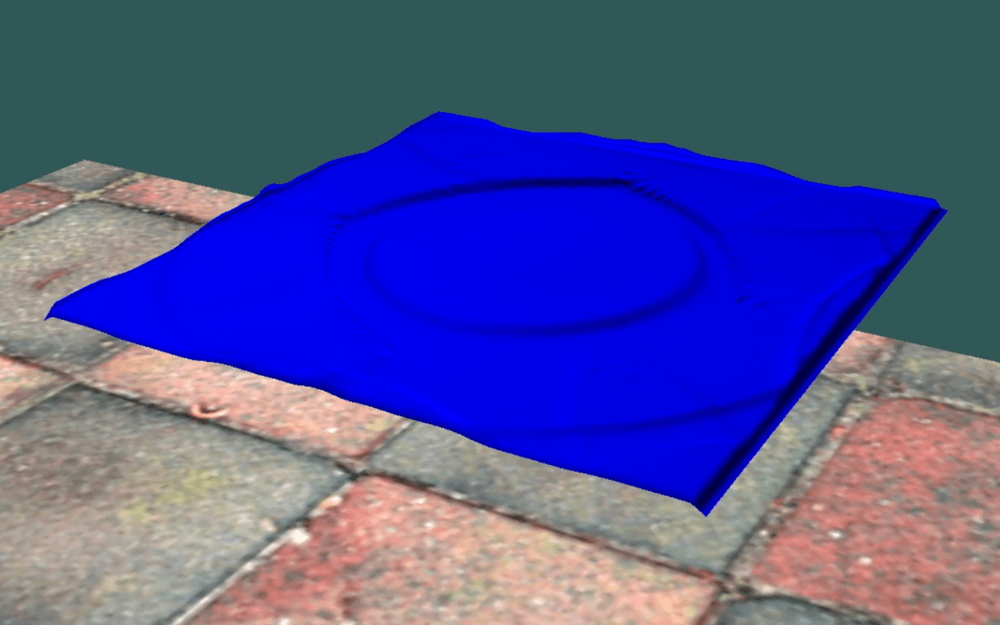

# OpenGLRenderer
Hi there! This is OpenGLRenderer, my tiny renderer that implements some widely-used rendering (and also simulation) algorithms.
This project, developed during my spare time for about a month, is still in its early stages. I plan to add more features in the future.
Some of the currently scheduled features are listed below:
* Physics based rendering
* Global illumination based on spherical harmonics
* Screen space subsurface scattering
* Denoising of ray tracing

Currently this repo is intended only for demonstration purpose, so some third-party libraries are not included in the repo.
All the core algorithm are included.

Here is what I have done.

## Defered Rendering
Defered rendering is hard to demo, it will be left blank here.

## Screen space ray tracing
I use specular reflection to demonstrate the effect of screen space ray tracing.
Here is an example of a small cabin being reflected by a mirror on the ground.

## Soft shadows
Three types of shadows are implemented: vanilla shadow, percentage closer filter (pcf) shadow and percentage closer soft shadow (pcss) shadow.
Here is a demo (top: vanilla shadow, middle: pcf, down: pcss).

<!--  -->

## Screen space ambient occlusion
Here is a demo of screen space ambient occlusion (ssao).
Top left: no ssao, top right: with ssao.
Bottom left: no ssao, zoom-in, bottom right: with ssao, zoom-in.

<!--  -->

## Shallow water equation
I also added a simple demo of shallow water equation (swe) using fragment shader, since the demo is supposed to run on all platforms, and macos doesnot support OpenGL compute shader.

<!--  -->

