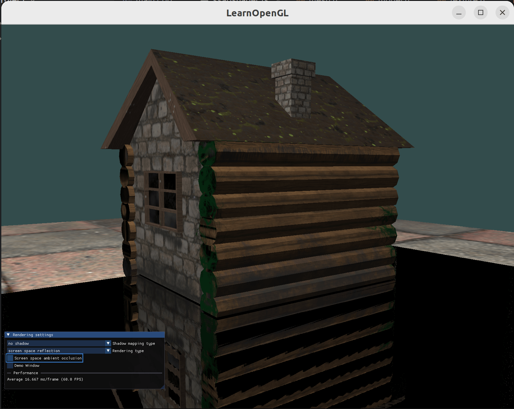
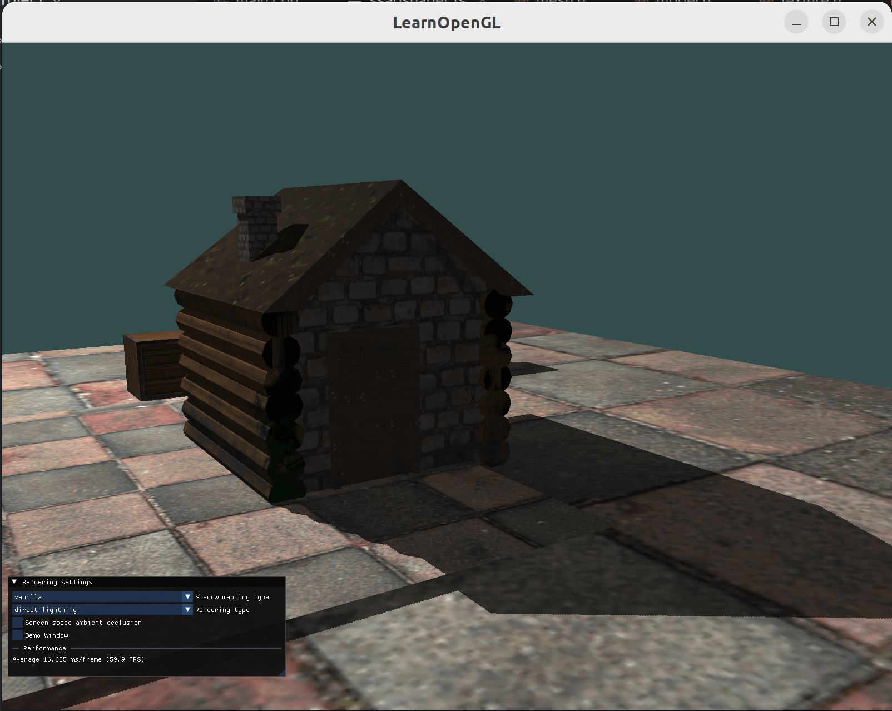
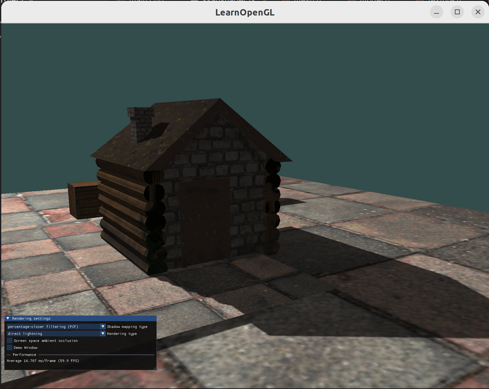
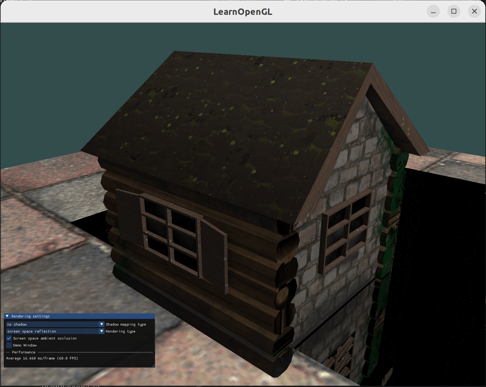
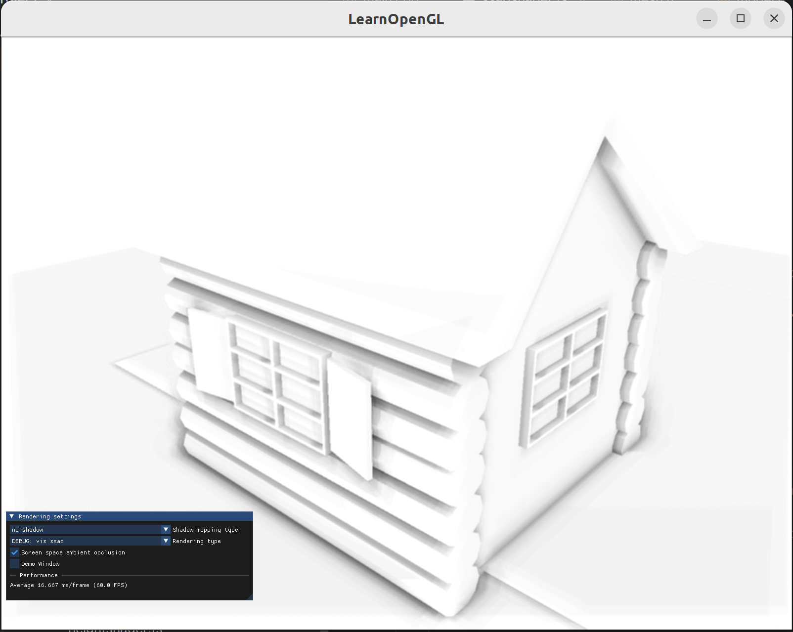
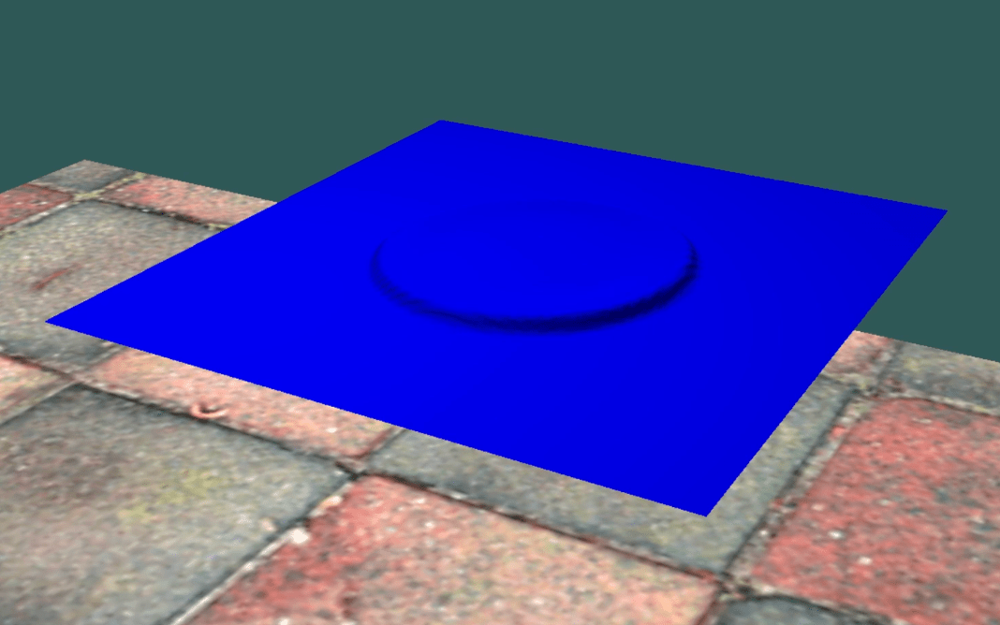
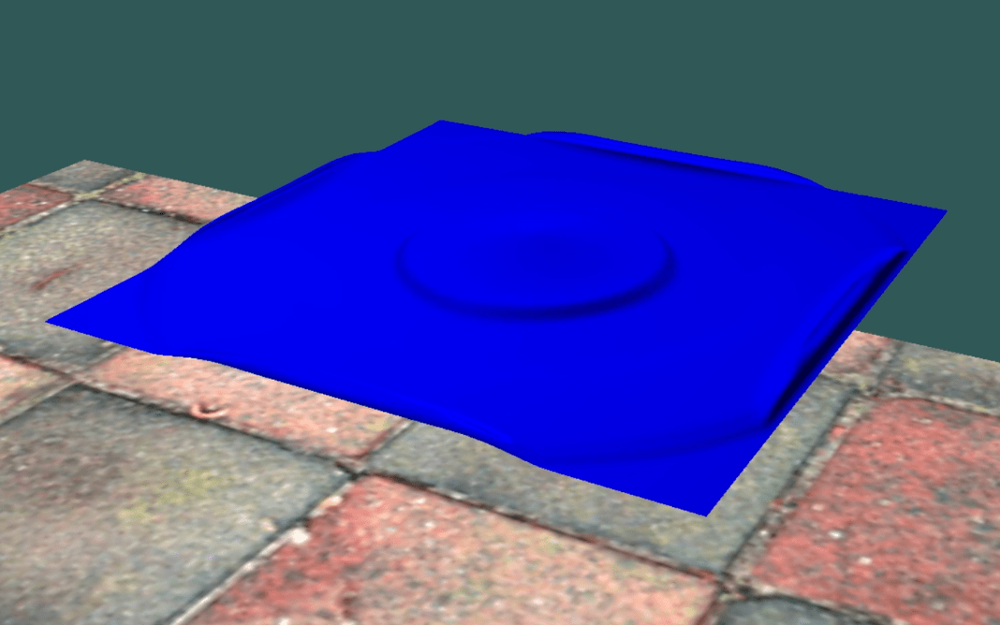
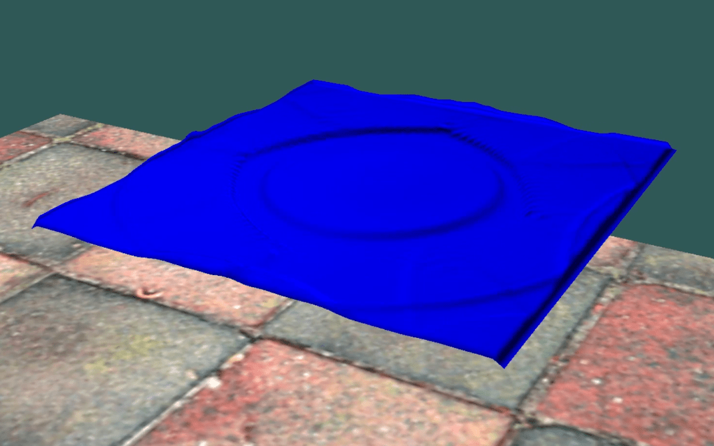

# OpenGLRenderer
Hi there! This is OpenGLRenderer, my tiny renderer that implements some widely-used rendering (and also simulation) algorithms.

Currently this repo is only for demo purpose, so some 3rd-party libs are not included in the repo.
If you want, you can add them manually according to CmakeList.
All the core algorithm are included.

Here is what I have done.

## Defered Rendering
Defered rendering is hard to demo, so it will be left blank here.

## Screen space ray tracing
I use specular reflection to demonstrate the effect of screen space ray tracing.
Here is an example of a small cabin being reflected by a mirror on the ground.

## Soft shadows
Three types of shadows are implemented: vanilla shadow, percentage closer filter (pcf) shadow and percentage closer soft shadow (pcss) shadow.
Here is a demo (left: vanilla shadow, middle: pcf, right: pcss).

## Screen space ambient occlusion
Here is a demo of screen space ambient occlusion (ssao).
left: no ssao, middle: wihth ssao, right: visualization of ssao color buffer.

## Shallow water equation
I also added a simple demo of shallow water equation (swe) using fragment shader (the demo is supposed to run on all platforms, and macos doesnot support OpenGL compute shader).

